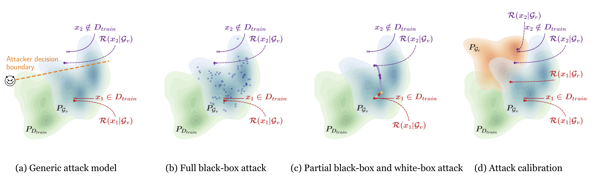

# GAN-Leaks

[](LICENSE)
[](https://www.python.org/)



This repository contains the implementation for ["GAN-Leaks: A Taxonomy of Membership Inference Attacks against Generative Models" (CCS 2020)](https://arxiv.org/abs/1909.03935) 

## Data Preparation
Download the [CelebA](http://mmlab.ie.cuhk.edu.hk/projects/CelebA.html) (aligned and cropped face) dataset and split the data into disjoint training (positive query), testing (negative query) and reference set. Save the png images into separate folders.

## Requirements
We provide a Tensorflow (used for pggan, wgangp and dcgan) and a Pytorch (used for vaegan) implementation of our attack models. 
The environments can be set up by using [Anaconda](https://www.anaconda.com/download/) with the following commands.
-   **Tensorflow:**
    ```bash
    conda create --name ganleaks-tf python=3.6
    conda activate ganleaks-tf
    conda install tensorflow-gpu=1.14.0
    pip install six tqdm pillow matplotlib scikit-learn
    ```
    
-   **Pytorch**
    ```bash
    conda create --name ganleaks-pytorch python=3.6
    conda activate ganleaks-pytorch
    conda install pytorch=1.2.0
    conda install torchvision -c pytorch
    pip install six tqdm pillow matplotlib scikit-learn scikit-image
    ```
    
## GAN Models
We pre-train the following victim GAN Models.
- [pggan (Progressive Growing of GAN)](https://github.com/tkarras/progressive_growing_of_gans)
    - **Requirements:** \
        activate Tensorflow environment
        ```bash
        conda activate ganleaks-tf
        ```
    - **Pre-processing data:**    
        ```bash
        cd gan_models/pggan
        python dataset_tool.py create_celeba_subset \
        "Directory for saving the output .tfrecords files" \
        "Training data directory containing the png images"
        ```
        
    - **Training:**  
        adjust the arguments (e.g. data_dir, dataset) in `pggan/config.py` 
        ```bash
        cd gan_models/pggan
        python run.py
        ```
    
    - **Generating samples:**
        ```bash
        cd gan_models/pggan
        python run.py --app gen --model_path "Path to the model .pkl file"
        ```
           
- [wgangp (Wasserstein GAN with Gradient Penalty)](https://github.com/igul222/improved_wgan_training)
    - **Requirements:** \
        activate Tensorflow environment
        ```bash
        conda activate ganleaks-tf
        ```
      
    - **Training:**
        ```bash
        cd gan_models/wgangp
        python train.py --data_dir "Directory of the training data"
        ```
      
    - **Generating samples:**
        ```bash
        cd gan_models/wgangp
        python sample.py --model_dir "Directory of the model checkpoints"  
        ```
 
- [dcgan (Deep Convolutional GAN)](https://github.com/carpedm20/DCGAN-tensorflow)
    - **Requirements:** \
        activate Tensorflow environment
        ```bash
        conda activate ganleaks-tf
        ```
      
    - **Training:**
        ```bash
        cd gan_models/dcgan
        python main.py --data_dir "Directory of the training data" 
        ```
      
    - **Generating samples:**
        ```bash
        cd gan_models/dcgan
        python main.py --app gen --checkpoint_dir "Directory of the model checkpoints"
        ```
      
- [vaegan (VAE GAN)](https://arxiv.org/abs/1909.12598)
    - **Requirements:** \
        activate Pytorch environment
        ```bash
        conda activate ganleaks-pytorch
        ```
      
    - **Training:**
        ```bash
        cd gan_models/vaegan
        python train.py --data_dir "Directory of the training data"
        ```
    - **Generating samples:**
        ```bash
        cd gan_models/vaegan
        python sample.py --model_dir "Directory of the model checkpoints"
        ```
      
      
## Attack Models
- **Full black-box attack (fbb):**        
    1. Generate samples
    2. Run attack:
    ```bash
    cd attack_models
    python fbb.py \
    -name "Name of the output folder" \
    -posdir "Directory of the positive (training) query png images" \
    -negdir "Directory of the negative (testing) query png images" \
    -gdir "Directory of the generated.npz file (default=model_dir)"
    ```

- **Partial black-box attack (pbb):**
    ```bash
    cd attack_models
    python pbb_***.py \
    -name "Name of the output folder" \
    -posdir "Directory of the positive (training) query png images" \
    -negdir "Directory of the negative (testing) query png images" \ 
    -gdir "Directory of the gan model checkpoints" \
    -init nn \
    -ndir "Directory of the fbb results" 
    ```
    ```pbb_***.py``` should be selected according to the type of victim gan model. 
    
- **White-box attack (wb):**
    ```bash
    cd attack_models
    python wb_***.py \ 
    -name "Name of the output folder" \
    -posdir "Directory of the positive (training) query png images" \
    -negdir "Directory of the negative (testing) query png images" \ 
    -gdir "Directory of the gan model checkpoints" 
    ```
    ```wb_***.py``` should be selected according to the type of victim gan model.
    
 - **Attack calibration:** \
    Train a reference model and perform the attacks on the reference model. Evaluate the calibrated attack by providing the ```"-rdir"``` argument (see below).
 
 
## Evaluation
To compute the AUC ROC value and plot the ROC curve:
```bash
cd attack_models/tools
python eval_roc.py --attack_type "fbb/pbb/wb" \
-ldir "Directory of the attack results" \
-rdir "Directory of the attack results on reference model (optional)"
-sdir "Directory for saving the evaluation results (optional)" 
```


## Pre-trained Models
Pre-trained victim model checkpoints can be downloaded using the links below. Specifically, the victim models are trained on 20k images with identity-based split. The selected images can be found [here](https://drive.google.com/file/d/12SwuWa7DBKFoPAUZsvkFVoO5shWZ7MMh/view?usp=sharing), with "identity index"(first column) and "image file name"(second column).

| |pggan   | wgangp | dcgan | vaegan|
|---|---|---|---|---|
|victim model| [link](https://drive.google.com/file/d/1GZ7d2gydv34toz9avLiFp3PGubfgg1_y/view?usp=sharing) | [link](https://drive.google.com/file/d/1DUii3lFv2ynm3pV1V3A5lmWyULowp4MP/view?usp=sharing) | [link](https://drive.google.com/file/d/1IT-kNsUvYtzMIOpuDkUHsbAMH7Ca4V1g/view?usp=sharing) | [link](https://drive.google.com/file/d/1AMgd8j8larwQ_qZrt3UfGqxw4t23CKjO/view?usp=sharing)|
    

## Citation
```bibtex
@inproceedings{chen20ganleaks,
author = {Dingfan Chen and Ning Yu and Yang Zhang and Mario Fritz},
title = {GAN-Leaks: A Taxonomy of Membership Inference Attacks against Generative Models},
booktitle = {ACM Conference on Computer and Communications Security (CCS)},
year = {2020}
}
```

## Acknowledgements
Our implementation uses the source code from the following repositories:
- [Progressive Growing of GAN](https://github.com/tkarras/progressive_growing_of_gans)
- [Wasserstein GAN with Gradient Penalty](https://github.com/igul222/improved_wgan_training)
- [Deep Convolutional GAN](https://github.com/carpedm20/DCGAN-tensorflow)
- [Perceptual Similarity Metric (Pytorch)](https://github.com/richzhang/PerceptualSimilarity)
- [Perceptual Similarity Metric (Tensorflow)](https://github.com/alexlee-gk/lpips-tensorflow)
- [PyTorch-LBFGS](https://github.com/hjmshi/PyTorch-LBFGS#pytorch-lbfgs-a-pytorch-implementation-of-l-bfgs)
      
